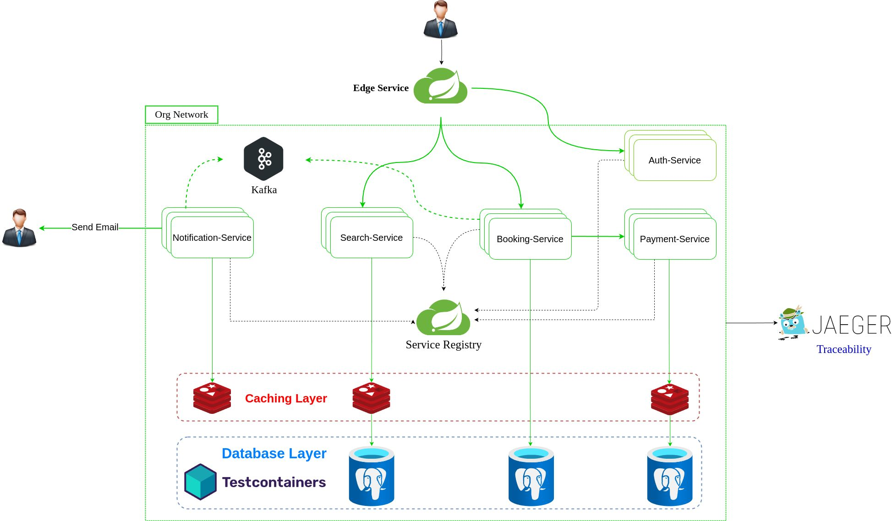

# Overview
This demo is a quick snapshot on microservices, it shows couples of use cases like  
* communication over API gateway "Spring Cloud GW" demonstrating sync calls 
* sync communication using kafka events
* Rate limiting 
* Observability using Grafana and Prometheus
* Traceability using Jeager

## How to Run ?
* Applications are very simple and require postgres DB to start.
* Under flight-service directory, you can find ``docker-compose.yml`` file that you can execute using 
```
     docker-compose up
     OR
     docker compose up (if you are using v2)
```

## System High Level Design (HLD)

